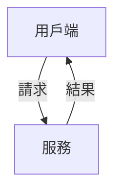

# 未完筆記 · AI 協作與數位創作

未完的繁體中文創作與實驗筆記。從清楚的委託、可靠的引用到可重現的程式，探索如何和 AI 一起把想法做成作品。

網站使用 Astro、TypeScript、Markdown、KaTeX 與 Pagefind，輸出靜態檔案並部署到 GitHub Pages。包含首頁、文章、實作筆記、關於、全文搜尋、RSS、sitemap 與 404；關於頁說明虛擬作者與人機共創方式。

## 本機預覽

建議 Node.js 24，最低版本為 22.12.0。安裝套件後啟動開發伺服器：

```bash
npm ci
npm run dev
```

預設網址是 `http://localhost:4321`。全文搜尋在正式建置時產生，驗證搜尋請使用：

```bash
npm run check
npm run build
npm run preview
```

受限環境可在指令前加上 `ASTRO_TELEMETRY_DISABLED=1`，避免 Astro 寫入使用者的遙測設定目錄。

## 網站內容與作者介紹

- `src/content/blog/`：文章，記錄 AI 協作、寫作與創作工具中的方法和判斷。
- `src/content/notes/`：實作筆記，提供推導、程式與可重現的小實驗。
- `src/data/profile.ts`：公開站名、署名、角色、網站描述、簡介與關注主題。
- `/cv/`：沿用既有網址的關於頁，介紹作者與網站，不展示空白履歷。

`profile.description` 同時用於預設 SEO 與 RSS；`profile.bio` 顯示於關於頁。Email 與社群連結僅填入希望公開的資訊，空值不產生聯絡入口。關於頁支援「列印 / 另存 PDF」，列印時隱藏導覽及操作按鈕。

首批三篇作品分別介紹創作委託、來源核對與程式驗收。舊文章網址 `learning-in-public` 和 `gradient-descent` 保留，方便既有連結繼續使用。

### 新增文章

新增 Markdown，例如 `src/content/blog/my-next-question.md`：

```markdown
---
title: '下一個值得追問的問題'
description: '用一兩句話說明本文處理的問題與讀者能得到的內容。'
date: 2026-09-19
tags: ['AI 協作', '數位寫作']
draft: true
featured: false
sample: false
---

## 問題從哪裡開始

用具體例子說明問題，並連結支持論點的來源。

## 如何檢查

留下能重做的步驟、結果與目前的限制。
```

`title`、`description`、`date` 必填；缺漏或無法解析的日期會讓建置失敗。日期使用 `YYYY-MM-DD`，網站依台北時區顯示。

| 欄位       | 用途                                           | 預設    |
| ---------- | ---------------------------------------------- | ------- |
| `tags`     | 文章分類與列表篩選                             | `[]`    |
| `draft`    | 排除於公開頁面、列表、RSS、sitemap 與搜尋      | `false` |
| `featured` | 首頁主打候選；目前只選第一篇，建議同時指定一篇 | `false` |
| `sample`   | 標記僅供展示排版的範例；正式作品應為 `false`   | `false` |

檔名決定網址；發布後保留檔名，修改標題不會改變網址。日期只影響排序，不提供定時發布。未完成的文章設為 `draft: true`，完成查證、校閱與建置驗證後再改為 `false`。

草稿在開發模式也不產生頁面。如需預覽，可暫時改為 `false`，提交前還原。公開儲存庫的原始檔仍可被讀取，`draft` 只控制網站輸出，私密素材不要放入內容目錄。

### 圖片、公式與引用

圖片放在 `public/images/`，使用站內絕對路徑及有意義的替代文字。數學公式使用 KaTeX，程式區塊標明語言；二級與三級標題自動產生文章目錄。

```markdown


行內公式：$E = mc^2$

$$
x_{t+1} = x_t - \eta \nabla f(x_t)
$$

## 參考資料

1. 作者，[直接支持論點的來源](https://example.com/paper)。
```

涉及程式或數值時執行範例，確認正文、表格與輸出一致；明確區分引用的事實、教學示例及作者提出的方法。

### Mermaid 圖表

流程、元件關係與信任邊界使用 `mermaid` 程式區塊，不以空白及箭頭字元拼出流程圖。
例如：

````markdown

````

每張圖需有單行 `accTitle` 與 `accDescr`；前者作為圖名，後者說明圖所傳達的關係。
缺少任一欄位會使建置失敗。優先使用由上往下的簡潔布局，圖中保留短標籤，細節放在正文。

Astro 的 remark 插件保留圖說與可展開的原始碼，再由隨站部署的 Mermaid 模組在瀏覽器中繪製 SVG；沒有圖的文章不下載繪圖模組。
圖表使用 strict 模式，無 JavaScript 或載入失敗時仍可閱讀文字說明。較寬的圖可在圖框內左右捲動，列印時縮至頁面寬度。
語法與無障礙欄位參考 [Mermaid 官方用法](https://mermaid.js.org/config/usage.html)及[無障礙說明](https://mermaid.js.org/config/accessibility.html)。

`npm run build` 檢查圖說欄位；瀏覽器測試才會驗證實際 SVG 渲染，修改圖表後需執行 `npm run test:e2e` 並確認桌面與手機呈現。

## 驗證

```bash
npm run check
npm run build
npm test
npx playwright install --only-shell chromium
npm run test:e2e
```

檢查涵蓋部署網址、必要輸出、站內連結與標題錨點、metadata、草稿排除、搜尋與標籤，以及桌面／手機導覽、鍵盤操作、文章閱讀、列印、404 和無 JavaScript 降級。

瀏覽器測試需要能啟動 Chromium 與本機伺服器；內容測試需要能建立子程序。若環境回報 `EPERM`，應調整執行環境權限，保留原有測試斷言。建置完成後的網站檔案位於 `dist/`，不提交建置輸出。

## GitHub Pages 發布

此專案部署於個人網站根網址 `https://<帳號>.github.io/`，不支援 `/repo/` 子路徑。GitHub Actions 會從儲存庫資訊設定正式網址，用於 canonical、Open Graph、RSS 與 sitemap。

1. 儲存庫名稱使用 `<帳號>.github.io`。
2. 在 **Settings → Pages → Build and deployment → Source** 選擇 **GitHub Actions**。
3. 提交來源檔與 `package-lock.json`，推送至 `main`；工作流程依序執行型別檢查、建置、內容驗證與瀏覽器測試。
4. 確認 **Check and deploy personal website** 成功，再檢查線上頁面、文章直接連結與搜尋。

Pull request 只檢查、不部署。`main` 的推送或手動執行會發布 `dist/`；建置或測試失敗不會取代上一個成功版本。發布使用 GitHub 提供的權限，不需要把網站金鑰放入專案。

本機要驗證正式網址時，可複製 `.env.example` 為 `.env` 並設定 `SITE_URL=https://<帳號>.github.io`。`.env` 已排除版本控制；未設定時使用本機網址，GitHub Actions 一律使用實際儲存庫網址。
