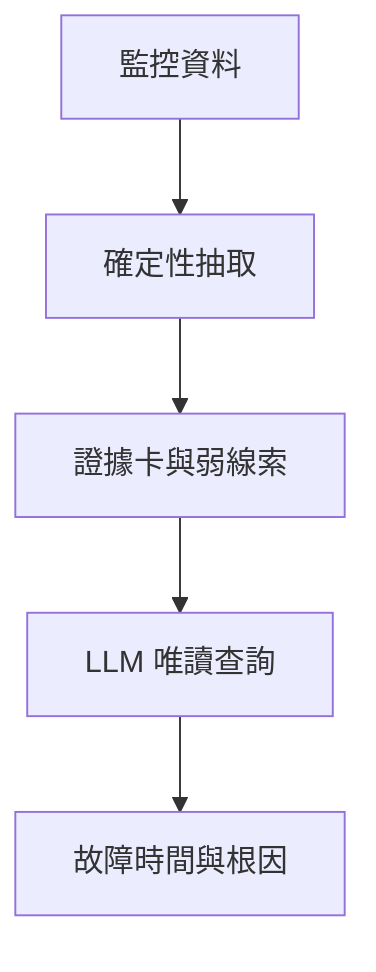

微服務的根因分析要從一次異常中找出故障時間、元件與原因。  
這件事難在故障會沿呼叫關係擴散：資料庫連線出問題時，呼叫它的服務也可能變慢；監控畫面上最醒目的異常，未必位於故障起點。  
指標是數值序列，追蹤紀錄服務間的呼叫，日誌則是大量重複事件，三者也無法直接當成同一段文字閱讀。

OpenRCA 的參考方法 RCA-Agent 讓大型語言模型（LLM）反覆寫 Python，探索原始監控資料並提交答案。  
[EviRCA 論文的背景與方法章節](https://arxiv.org/html/2609.19825v1)指出，這使模型同時負責異常偵測、尋找候選元件和解釋原因。  
EviRCA 提出的分工是先用固定程式處理可重複的資料工作，再把相互矛盾的線索交給模型判斷。

## 從監控資料做出可追查的證據卡

第一階段讀入查詢時段的指標、追蹤與可用的日誌，依元件和資源類型建立「證據卡」。  
每張卡記錄異常開始時間、支持它的關鍵指標，以及可能的粗略原因。  
偵測器會先依指標的日常分布區分幾種形狀，再用對應規則找持續異常；幾乎一直為零的序列，不會只因極小波動就被判為故障。  
若嚴格門檻完全找不到異常，系統另列出最接近門檻的弱線索，避免交給模型空白清單。  
[論文 III-B 節](https://arxiv.org/html/2609.19825v1)描述了這些步驟。

微服務部署關係也參與整理。  
若同一節點上的多個 pod（Kubernetes 一起部署的容器單位）同時變慢，程式可把它們的線索彙整到共同節點；只有單一 pod 異常時，則保留 pod 層級。  
這種彙整不會丟掉原本的 pod 證據，模型仍可回頭比較。  
各系統的欄位、時間單位、元件層級與資源類型對應原因，寫在宣告式的資料轉接設定（adapter）裡，讓共用流程知道如何讀取不同系統的資料。  
[論文 III-B、III-D 節](https://arxiv.org/html/2609.19825v1)給出這層分工。

第二階段的模型只能透過預先定義的唯讀工具查看候選卡、指標摘要、呼叫關係，以及系統有提供的日誌資訊。  
例如它可查某個元件的指標序列，再沿呼叫圖比較上游與下游；最終時間取自支持答案的證據卡，而非請模型憑空估計。  
工具中的日誌取樣仍可能呈現少量原始文字，因此「不讀原始資料」應理解為沒有任意瀏覽整批資料或執行自寫程式的權限。  
[論文 III-C 節與表 II](https://arxiv.org/html/2609.19825v1)列出了介面。

## OpenRCA 成績要連同條件一起讀

作者在 OpenRCA 的 Bank、Telecom、Market 三個系統，共 335 個案例上評估 EviRCA。  
每個案例給定 30 分鐘資料及查詢，可能要求故障時間、元件、原因中的一項或多項；嚴格的 Correct 指標要求所有被問欄位都正確、預測故障數量相符，時間誤差在正負 60 秒內。  
元件與原因則來自各系統已知的候選集合。  
[論文 IV-A 節](https://arxiv.org/html/2609.19825v1)說明了測試設定。

[表 III](https://arxiv.org/html/2609.19825v1)中，EviRCA 搭配 `deepseek-v4-pro` 與 `qwen3.7-plus` 的整體 Correct 分別為 43.9% 和 40.6%；同兩個模型下，最佳比較方法的整體成績最高為 15.2%。  
這是 OpenRCA 上的加權整體結果，不能當作一般生產事故的成功率。  
不同系統也有落差：`deepseek-v4-pro` 在 Telecom 為 62.7%，Market 只有 29.7%，顯示資料條件影響很大。

成本數字的比較範圍更窄。  
[表 IV](https://arxiv.org/html/2609.19825v1)只列出 `deepseek-v4-pro` 下，EviRCA 與會反覆執行程式的 RCA-Agent 逐案例比較：在三個系統中，token 用量約為 RCA-Agent 的 1/15 至 1/26，耗時約為其 1/3 至 1/20。  
token 是模型處理文字的單位；先把大量資料整理成證據，也就減少了模型需要反覆閱讀的內容。  
Bank 仍需逐案例重建較大的追蹤呼叫圖，所以時間優勢較小。  
這些倍數不涵蓋另一個模型，也沒有把人工建立 adapter 與部署維護成本換算成金額。

## 判斷與抽取各有一道上限

分工讓失敗位置更容易辨認。  
[論文 IV-E 節](https://arxiv.org/html/2609.19825v1)將單一故障的失敗拆開後，約 22.5% 是正確元件根本沒有進入證據；35% 則是模型選了異常更強的下游元件。  
前者要改善抽取的涵蓋率，後者要改善對時間先後與傳播方向的判斷。  
Telecom 的消融實驗也顯示，拿掉追蹤或同節點彙整，Correct 分別下降 45.1 與 37.3 個百分點，兩種證據在該系統的節點故障特別關鍵。  
[論文表 V](https://arxiv.org/html/2609.19825v1)提供了比較。

這套方法仍受 OpenRCA 的封閉候選集合、已知故障數量與可取得部署拓撲等條件約束。  
若真實元件沒有進入候選，模型的後續判斷也受限於這份不完整的證據。  
[論文 V-B 節](https://arxiv.org/html/2609.19825v1)將證據涵蓋率列為主要限制。  
EviRCA 因此提供了一種可檢查的工作分配：抽取器提供足夠且有來源的候選，模型處理候選之間的因果判斷；目前的實驗支持這種分工在 OpenRCA 有效，尚未證明它能獨立處理開放環境中的事故。  
本文沒有重現實驗。

## 參考資料

- [EviRCA 論文全文，arXiv v1](https://arxiv.org/html/2609.19825v1)
- [EviRCA 論文資訊與版本紀錄，arXiv](https://arxiv.org/abs/2609.19825v1)
