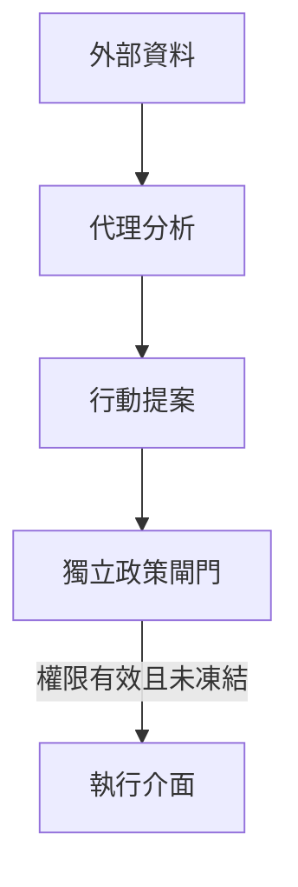

一個大型語言模型（LLM）讀完新聞後，建議賣出某檔股票，與它能直接呼叫交易介面賣出股票，是兩種不同的安全問題。  
後者讓模型的判斷連上真實資產；如果新聞被污染、工具權限過大，錯誤就可能在下一次人工檢查前付諸執行。  
[FARSIGHT](https://arxiv.org/pdf/2609.19705v1) 以金融交易 AI 代理（agent）為案例，追問系統在極端波動與蓄意操縱下，究竟靠什麼守住這條界線。

## 執行權讓威脅從文字走向行動

交易代理可能同時讀取行情、新聞和其他代理的意見，更新記憶，再呼叫下單工具。  
外部文章若夾帶「忽略風險限制」之類的指令，模型可能把資料當成命令；即使沒有提示注入，延遲或偽造的行情也可能推動錯誤決策。  
而代理的交易又會改變市場與其他代理看到的訊號，讓一次失誤經由回饋擴大。  
論文因此把**執行權、市場回饋和攻擊者獲利誘因**一起納入威脅模型，而不只檢查模型會不會生成不安全的文字。

這個視角也解釋了為何「模型知道要控管風險」不等於系統有風險控制。  
當模型本身或它讀到的內容出錯時，交給同一個模型解讀並執行的限制，未必能及時攔住行動。  
金融是論文用來觀察高風險代理的領域；同樣的權限問題，也值得在其他能改動真實世界狀態的代理中檢查。

## FARSIGHT 評的是公開設計證據

這篇系統化知識整理（SoK）研究提出 FARSIGHT 框架，用公開方案的設計證據評分，並非拿 15 個運行中的系統做滲透測試。  
作者從 2023 年 1 月至 2026 年 3 月的文獻搜尋取得 127 篇候選，經篩選後，對 15 個有足夠架構資訊的學術方案評分；這批方案包含分析、模擬與可連接執行介面的不同設計。  
[論文第 4.1 節](https://arxiv.org/pdf/2609.19705v1#page=6)交代了選取流程。

評分分為兩軸。  
穩健性檢查能否提早察覺異常、迅速回應衝擊、限制損失，以及在事件後復原；安全性則檢查資訊來源、提示與工具、長期記憶，以及代理遭控制後能否被隔離。  
每項由論文描述、系統圖或實驗中可找到的指標判為完整、部分或未見對應控制。  
兩位評估者在 15 個方案、每案 9 項的 135 個評分中，原先有 126 項一致，歧異經討論後形成最終分數；這說明規則可追溯，也提醒我們辨認架構證據仍需要判斷。  
[論文附錄 A、B](https://arxiv.org/pdf/2609.19705v1#page=19)列出評估者一致性與評分規則。

## 數字顯示的是控制缺口

依[論文表 3 與第 5 節](https://arxiv.org/pdf/2609.19705v1#page=9)，15 個方案中有 80% 至少一項核心穩健性指標未達標；沒有方案具備評分規則要求的獨立快速中斷機制。  
例如風險代理可以提出警示，但若停單還得等待下一輪模型推論或代理討論，市場衝擊已經繼續發生。  
作者也指出，六個方案對損失限制有部分設計，卻沒有在公開描述中呈現明確、由程式獨立強制執行的完整機制。

摘要提到「100% 有安全弱點」，更要連同評分尺規閱讀。  
[附錄 B 對 S2.1 至 S2.3 的說明](https://arxiv.org/pdf/2609.19705v1#page=21)指出，提示、工具與記憶三項要拿到最高等級，須在設計上移除對應攻擊面；保留執行能力、即使有主動防禦，也至多取得部分評級。  
因此這個比例表示受評方案沒有一個在所有相關項目都達到「攻擊面不存在」的標準，**不表示 15 個方案都已遭實際攻破**，也不能據此估計它們在真實市場被利用的機率。

## 把最後的決定權留在模型外

論文的設計建議可以整理成一道執行前的閘門。  
模型仍可整理訊息、提出交易意圖，但額度、標的、時段與工具權限由外部政策引擎驗證；偵測到異常時，獨立的規則路徑先凍結或取消訂單，不等待模型繼續推理。  
唯讀分析代理不需要下單權限；具有執行權的代理也應受限於狹窄的工具介面、速率與額度，並保留操作人員可立即撤銷權限的停止通道。  
[論文第 6 節](https://arxiv.org/pdf/2609.19705v1#page=12)提出了這些分層控制。

圖中閘門是根據論文建議畫出的設計示意，並非作者已部署、量測過的架構。  
輸入端仍需記錄來源並交叉查證；長期記憶的寫入應經來源與內容檢查，避免一次被污染的觀察反覆影響後續決策。  
如果某個代理已遭控制，系統還要能單獨隔離它，並檢查多個代理是否同步提出異常行動。  
這些控制各守一個環節，不能靠一句「請遵守規則」取代。

FARSIGHT 的結論受公開資料範圍所限：未寫在論文裡的控制可能存在於程式碼或後續版本；作者的評級也無法替代對運行系統的攻擊測試。  
這套框架適合用在授予代理執行權之前，逐項問清楚哪些限制由模型外的程式與人強制執行，再用實際測試確認這些界線能否擋住失效路徑。

## 參考資料

- [Wang 與 Saxena，FARSIGHT 原論文（arXiv v1，PDF）](https://arxiv.org/pdf/2609.19705v1)
- [arXiv 版本與作者資料](https://arxiv.org/abs/2609.19705v1)
