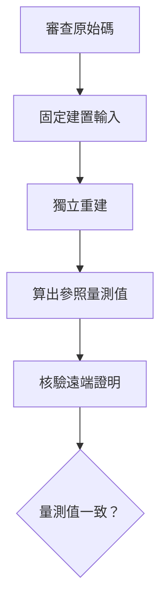

把私密資料交給遠端服務前，我們可能想先確認：它執行的是不是自己看過的程式。  
可信執行環境（TEE）提供的遠端驗證（remote attestation），能讓服務交出一份由硬體支援的證明，包含程式載入時的「量測值」。  
但即使這份證明是真的、量測值也符合服務宣稱的參照值，仍有一段關係待查：那個值如何對應到公開、可審查的原始碼？  
[Wilde 等人的研究](https://arxiv.org/html/2609.11411v1)沿著這段關係檢查 115 個 TEE 部署，讓遠端驗證與可重現建置之間的分工變得具體。

## 硬體證明停在哪裡

以 Intel SGX 為例，量測值是受保護程式在初始化時，其程式碼與資料的密碼學摘要；內容不同，摘要通常也會不同。  
遠端驗證者會檢查硬體證明的真實性，並把報告中的量測值與預先認可的參照值比較。  
這可以辨認遠端執行的初始內容是否符合指定版本，卻不會自動交代參照值的來歷。  
若參照值只由服務商提供，使用者仍須相信它對應到公開的程式，而非另一份未公開的建置成果。（[論文第 2.1 節](https://arxiv.org/html/2609.11411v1)）

把原始碼接上這份證明，需要有人用同一版本的原始碼、編譯器、依賴套件和設定，獨立產生位元組一致的成果，再算出相同量測值。  
這就是此處所說的「可重現建置」；只證明兩個程式功能相近，無法完成密碼學摘要的比對。  
下圖整理的是查驗步驟：先獨立算出參照量測值，再核驗遠端的硬體證明、比對其中的量測值。  
這並非論文要求每個使用者都得親自編譯，而是兩者之間需要可獨立查驗的證據。（[論文第 1、2.2 節](https://arxiv.org/html/2609.11411v1)）

## 115 個部署，先卡在公開輸入

研究團隊從開源 SGX 專案清單與雲端市集挑選符合條件的應用，將同一應用在不同 TEE 上的部署分開計算，得到 **115 個部署案例**。  
他們先找兩類必要材料：附建置說明的原始碼，以及可供比較的參照量測值；後者也可以從正式發行的執行檔或映像檔擷取。  
**88 個部署案例缺少這兩類材料的完整組合**，因此無法進入實際重建比對；只有 27 個具備這道門檻所需的公開材料。  
這裡的「無法重現」首先是外部查驗做不到，不能解讀成研究者已替那 88 個部署逐一建置、並發現量測值全都不一致。（[論文第 3.1 節、表 2](https://arxiv.org/html/2609.11411v1)）

在能繼續檢查的 27 個部署案例中，團隊先依公開說明建置最新版本，25 個能獨立編譯；再從成果擷取量測值，與正式版本比較。  
最後 **7 個**只靠公開資料就能重現，另 **3 個**要靠開發者補充未公開資訊，合計 **10／115**。  
論文所說約 **91% 無法重現**，是把缺少必要材料、建置失敗，以及建置後量測不符的部署案例一起算入，並非 105 個都經過相同的實測比對。  
對一般使用者來說，後三個雖有研究者協助重現的結果，公開文件仍不足以獨立走完驗證流程。（[論文第 3.2 節、表 3](https://arxiv.org/html/2609.11411v1)）

## 為什麼有原始碼也可能對不上

即使原始碼公開，建置環境仍會進入成果。  
例如編譯時寫入日期或絕對路徑、依賴套件版本漂移，可能讓兩份功能相同的程式產生不同位元組，接著得到不同量測值。  
論文也記錄了更難由外部補齊的條件：SGX 版 Secret Network 的正式執行檔使用未公開的簽章金鑰；研究者依公開原始碼建置 v1.14.0，無法重現正式量測值。  
同一研究在該專案較新的 SEV-SNP 版本成功重現量測值，說明問題會隨部署流程改變，不能只看產品名稱。（[論文第 2.2、3.3 節](https://arxiv.org/html/2609.11411v1)）

這也解釋為何公布一串參照值仍不夠：外部需要知道它來自哪份原始碼、哪套工具與依賴，以及用什麼命令得到。  
論文把 84 個非學術專案依主要建置方式分組，使用 Nix、Bazel、Yocto 等工具的一組有 7 個部署案例，其中 3 個可重現；未註明主要建置系統的一組有 57 個，其中 3 個可重現。  
這是觀察到的關聯，樣本也小，不能推成採用某工具就必然可重現；它提示的是固定輸入與記錄流程值得列入正式發行工作。（[論文第 3.2、6.1 節](https://arxiv.org/html/2609.11411v1)）

## 讀這個結果時保留的界線

這份研究的樣本以 SGX 為主，且來自指定的公開清單與市集，不是對所有 TEE 服務的隨機抽樣；不同架構的成功率也不宜直接排名。  
研究者沒有證明那 105 個未能重現的部署含有惡意程式或漏洞，指出的是目前公開證據不足以把已審查原始碼與遠端量測值接起來。  
即使兩者對上，可重現建置也只建立版本來源的可追溯性，不會替原始碼完成安全審查，更不保證執行期間不受其他攻擊。（[論文第 3.1、5.4 節](https://arxiv.org/html/2609.11411v1)）

我讀這篇後會把驗證要求寫成一個可檢查的問題：第三方能否從指定版本的原始碼與完整建置輸入，獨立算出遠端證明中那個量測值？  
如果答案只能由開發團隊口頭補充，硬體證明仍可證明執行中的身分，但公開審查與實際部署之間的連結，還需要可交付的建置紀錄來支撐。

## 參考資料

- [論文全文："They don't care about this": A Systematic Study of TEE Build Reproducibility in the Wild（arXiv v1）](https://arxiv.org/html/2609.11411v1)
- [arXiv 摘要、作者與版本紀錄](https://arxiv.org/abs/2609.11411v1)
