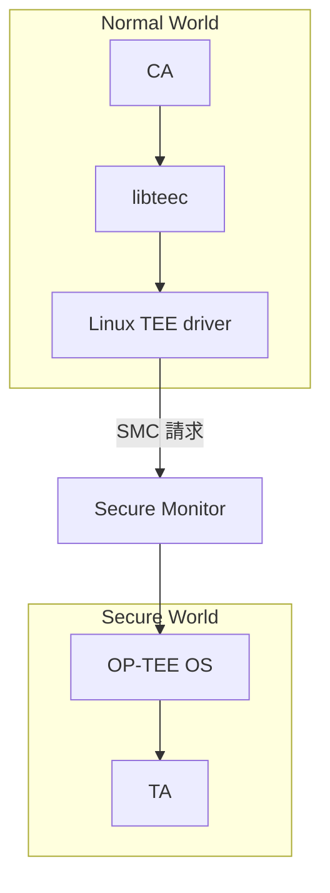
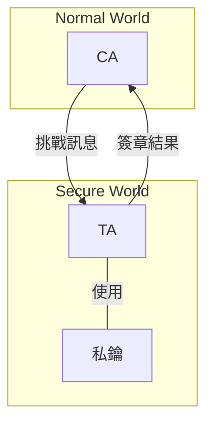
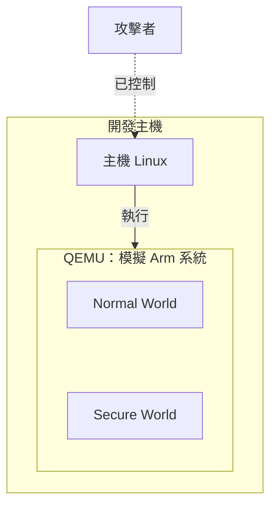

當設備透過網路連上伺服器時，伺服器需要確認：眼前這個連線，真的是那台設備發出的嗎？  
一種做法是讓設備持有私鑰，對伺服器送來的挑戰訊息產生數位簽章，再由伺服器用配對的公開金鑰檢查。

接下來的問題是：私鑰應該放在哪裡？  
如果設備上的 Linux 遭到入侵，我們還希望保住哪些東西？

這個系列記錄我學習 Arm TrustZone-A 與 OP-TEE 開發的過程，從設備私鑰的保護出發，逐步延伸到安全介面、公開漏洞與修補分析。  
文中會隨著實作補充終端機、C 語言與編譯工具的基礎，讓沒有 TEE 經驗的人也能跟著重現。

第一篇從設備裡的程式與資料談起，整理 CA 與 TA 的分工，以及它們之間的信任邊界。  
其中一個值得追問的地方是：「私鑰沒有被取走」，為什麼仍不足以代表服務安全？

## 從攻擊者的能力談起

如果只想防止一般使用者讀取檔案，Linux 的檔案權限就能提供一層保護。  
但這裡採用更強的假設：攻擊者已控制 Linux 核心，可以操控一般應用程式、讀取它們的記憶體，也能修改送往其他元件的請求。

在這個假設下，把私鑰存成只有 root 可讀的檔案並不夠。  
root 是 Linux 裡的管理者身分，檔案權限也由 Linux 執行；當這一層已不可信，就需要找另一個保護邊界。

這種先列出「要保護什麼、攻擊者能做什麼、哪些部分仍可信」的做法，叫作**威脅模型**。  
它會決定我們怎麼設計服務，也決定後面的測試應該檢查什麼。

## TrustZone、TEE 和 OP-TEE 各負責什麼？

這三個名詞常一起出現，但各自描述不同層次：

| 名稱 | 這裡的意思 |
| --- | --- |
| Arm TrustZone-A | Arm A-profile 處理器與系統的安全隔離機制，提供 Secure 與 Non-secure 的區分 |
| TEE，可信執行環境 | 與一般作業系統隔離、執行敏感程式的環境 |
| OP-TEE | 一套開源 TEE 軟體，常搭配 Arm TrustZone 與 Linux 使用 |

在本系列採用的基本模型裡，Linux 位於 **Normal World**，也就是 Non-secure 的一側；OP-TEE 位於 **Secure World**。  
這裡的「World」描述安全狀態與相應的執行環境，不表示一定有兩顆處理器，也不表示把硬體平均切成兩半。

TrustZone 提供隔離所需的硬體機制，OP-TEE 則管理安全應用程式及其服務。  
因此，處理器支援 TrustZone，不等於設備已安裝 OP-TEE；實際能保護什麼，還要看平台配置與軟體。[OP-TEE 官方介紹](https://optee.readthedocs.io/en/latest/general/about.html)

本系列的主線是 Armv8-A 的 QEMU 環境。  
它屬於這裡討論的 A-profile 路線；微控制器使用的 TrustZone-M 有不同的程式與切換模型，不同平台的開發方式不能直接混用。

## 把一個服務拆成 CA 和 TA

回到設備簽章的例子，我們可以把工作拆成兩部分：Linux 程式處理網路連線；隔離環境中的程式保存私鑰，檢查請求並執行簽章。  
在 OP-TEE 開發中，前者可以是 **CA（Client Application，用戶端應用程式）**，後者是 **TA（Trusted Application，可信應用程式）**。

| 元件與執行位置 | 在例子中的工作 |
| --- | --- |
| CA（Normal World） | 接收挑戰訊息，請求簽章，把結果送回伺服器 |
| `libteec`、Linux TEE driver（Normal World） | 把 CA 的請求送往 TEE，傳回結果 |
| OP-TEE OS（Secure World） | 管理 TA，提供記憶體、密碼運算等服務 |
| TA（Secure World） | 檢查請求與使用條件，以私鑰完成允許的操作 |

CA 使用 TEE Client API 與 TA 溝通；API 是程式之間約定好的呼叫介面。  
CA 先建立連線，再開啟與指定 TA 的 session，也就是一段互動關係，接著傳送命令與資料。[OP-TEE Client API 說明](https://optee.readthedocs.io/en/latest/architecture/globalplatform_api.html#tee-client-api)

把呼叫路徑簡化後，可以畫成：

這張圖採使用 SMC 通訊的基本部署；其他配置可能有不同路徑。  
為了把切換位置畫清楚，Secure Monitor 放在兩個 World 的分組之外；這是架構上的簡化，圖中位置不代表它是獨立於整個系統的第三個硬體區域。  
在這個模型中，SMC 指令讓處理器進入 Secure Monitor 處理；Monitor 協調安全狀態的切換，再由 OP-TEE 處理送來的服務請求。[Linux OP-TEE driver](https://docs.kernel.org/tee/op-tee.html)、[OP-TEE 切換流程](https://optee.readthedocs.io/en/latest/architecture/core.html#normal-world-invokes-op-tee-os-using-smc)

CA 發出請求後，仍然是 Normal World 的程式。  
即使以 `sudo` 執行，取得的也是 Linux 權限；它不會因此變成 TA。

### 編譯的位置，和執行的位置不同

後續實作預計在開發用的 Linux 環境編譯 CA 和 TA。  
「編譯」就是用工具把原始碼轉成目標環境能使用的程式；工具在哪裡執行，與產物最後在哪裡執行，是兩件事。

本系列先使用檔案型的 user-mode TA，也就是在 OP-TEE 管理下執行的應用程式。  
它的 `.ta` 檔案可以存放在 Normal World 的檔案系統，載入時由輔助程式 `tee-supplicant` 提供給 OP-TEE，依該環境的 TA 驗證政策檢查後，在 Secure World 載入。  
因此，看到檔案放在 Linux 裡，不能直接判斷它也在 Linux 裡執行。[TA 的儲存與載入](https://optee.readthedocs.io/en/latest/architecture/trusted_applications.html#ree-filesystem-ta)

## 金鑰服務的信任邊界

在這個案例中，Linux 所在的 Normal World 已被視為可能受攻擊者控制，而 Secure World 的隔離與服務仍是保護私鑰的依據。  
這兩側採用不同的信任假設，彼此之間便形成了**信任邊界**。

金鑰服務暫定採用以下設計：私鑰在 TA 中產生及使用，介面只接受簽章請求，不提供取出私鑰的命令。  
這是用來推理的設計案例，目前還沒有實作這個簽章服務。

沿著一次簽章請求觀察，挑戰訊息由 CA 傳入 TA，簽章結果再回到 CA；私鑰則留在 TA 使用的安全記憶體中。  
即使請求跨過了信任邊界，攻擊者仍能影響經過 Linux 的資料。

這張圖省略了 libteec、driver 與 Monitor，只保留服務介面上的資料流：跨界的是訊息和結果，私鑰不必離開 TA。  
箭頭表示資料的傳遞方向，不代表資料跨界後就可信；經過 Linux 的訊息仍可能被替換或重送。

### 資料的位置與可見範圍

| 資料 | 位置與 Linux 被控制後的考量 |
| --- | --- |
| 挑戰訊息 | CA 接收，再傳入 TA；攻擊者能看到、替換或重送它。 |
| 私鑰 | 依本例設計留在 TA 使用的安全記憶體中；保護它仍依賴硬體隔離、啟動配置、Monitor、OP-TEE 與 TA 的正確性。 |
| 簽章結果 | TA 產生，再回到 CA；攻擊者能取得、丟棄或替換傳輸內容，伺服器仍須驗證簽章及對應挑戰。 |

跨界傳遞的是待簽章的訊息與簽章結果，私鑰不需要回到 CA。  
這是把服務拆成 CA 與 TA 後，希望建立的保護範圍。

不過，攻擊者也可能不取走私鑰，而是不斷要求 TA 幫他簽章。  
若 TA 對任何請求都照做，金鑰即使沒有外洩，仍可能被用來完成我們不允許的操作。

因此，設計還缺少「哪些請求可以使用這把金鑰」的規則，以及讓 TA 判斷規則是否成立的可信依據。  
只讓 CA 傳入一個「我有權限」欄位並不夠，因為我們已假設攻擊者可以修改 CA 的請求。  
後續的授權章節會回到這個缺口。

## 跨過邊界的資料，仍然需要檢查

CA 與 TA 可以透過共享記憶體交換資料。  
共享記憶體是通訊雙方用來交接資料的區域；CA 描述資料位置、長度與輸入輸出方向，再由相關元件處理傳遞。  
底層也可能複製資料，具體方式會在共享記憶體篇實作時確認。[共享記憶體 API](https://optee.readthedocs.io/en/latest/architecture/globalplatform_api.html#tee-shared-memory)

這樣的交接並不讓資料自動可信。  
TA 仍要檢查命令、參數型別和長度；處理共享資料時，也要考慮另一側可能修改它。  
這些檢查會涉及 buffer，也就是暫存資料的記憶體區域；後續實作將具體記錄它的大小、內容與存取方式。

同樣地，如果明文原本由 Linux 收集，或 TA 把解密後的明文交回 CA，Linux 就看得到那份資料。  
判斷保護範圍時，要沿著資料走一遍，而不是只看程式是否曾呼叫 TA。

## 為什麼從 QEMU 開始？

QEMU 可以在開發電腦上模擬 Arm 系統，讓我們練習啟動 OP-TEE、編譯程式和觀察兩個 World 的互動。  
OP-TEE 官方提供 Armv8-A 的 QEMU 建置流程，因此可以先沿著一套共同環境學習，再處理實體板子的差異。[官方 QEMU 說明](https://optee.readthedocs.io/en/latest/building/devices/qemu.html#qemu-v8)

實作記錄也會區分兩個位置：**執行 QEMU 的主機**，以及 **QEMU 裡被模擬的系統**。  
主機裡的 Linux 終端機，不是模擬系統裡的 Normal World 主控台；下一篇會逐步標出每條命令應在哪裡執行。

QEMU 的系統模擬包含處理器、記憶體和裝置，這些都在主機上運作。[QEMU 系統模擬介紹](https://www.qemu.org/docs/master/system/introduction.html)  
由這個模型可知，模擬系統裡的 Secure World 不能用來對抗控制主機的攻擊者。  
我們用它學程式行為與測試方法；實體硬體的隔離、啟動設定與攻擊防護，留到對應的平台驗證。

圖中的 Secure World 是 QEMU 所模擬系統的一部分，不是主機上的保護容器。  
它很適合用來觀察程式與呼叫路徑，但無法據此推論實體平台具有相同的隔離效果。

## 後續的學習方向

系列規劃分成四段，下面是後續主題，尚未完成的篇章會逐步補上：

| 階段 | 篇次與主題 |
| --- | --- |
| 建立開發基礎 | 02 環境與啟動；03 第一個 CA／TA；04 參數與共享記憶體 |
| 看懂並設計服務 | 05 呼叫流程與除錯；06 RSA 加解密；07 簽章與授權；08 安全儲存 |
| 練習安全研究 | 09 安全測試與 fuzzing；10 公開漏洞與修補；11 效能實驗 |
| 對照實體平台 | 12 Jetson 環境、移植與實驗 |

其中 fuzzing 是自動產生或變更輸入、尋找異常行為的測試方法。  
判讀這類測試的結果，需要正常與錯誤案例作為依據，才能區分預期的拒絕行為與程式異常。

對這個金鑰服務而言，隔離私鑰只是其中一部分；跨界資料如何檢查、金鑰操作如何授權，也都影響最後的保護範圍。  
接下來的 QEMU 實作將從環境建置與啟動記錄開始，把這裡整理的元件關係對照到實際的程式與日誌。
